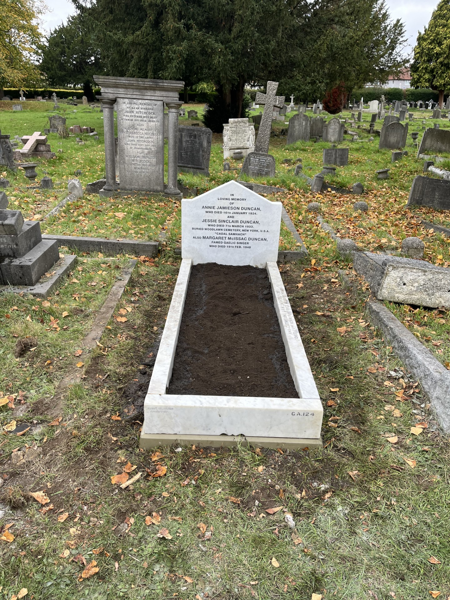
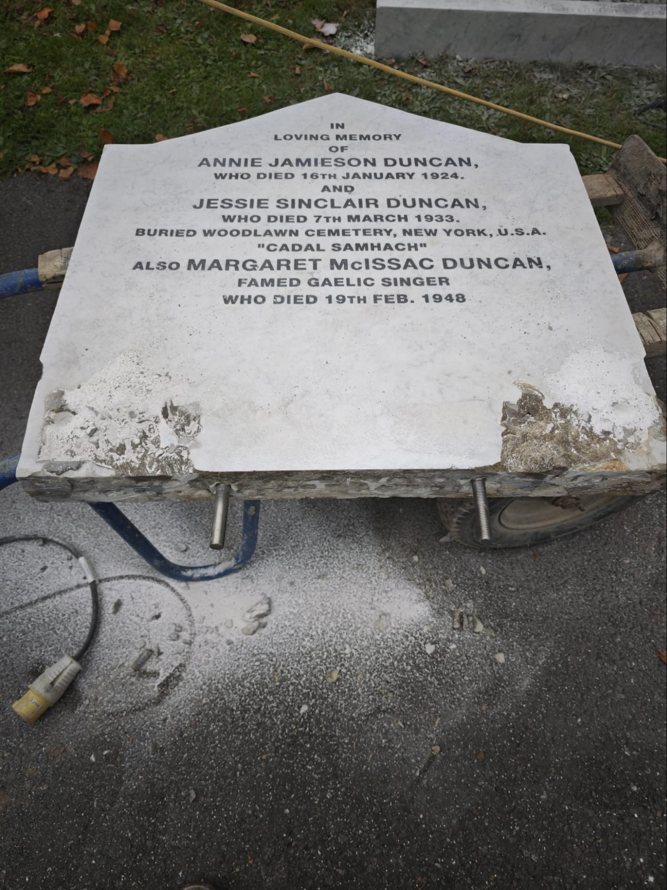
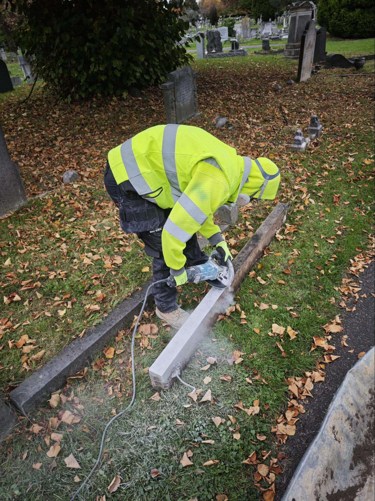
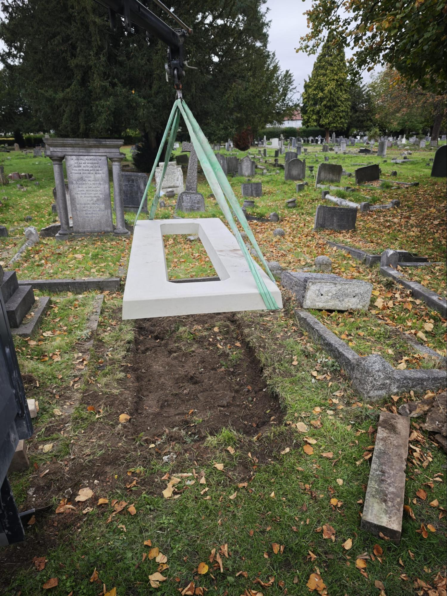
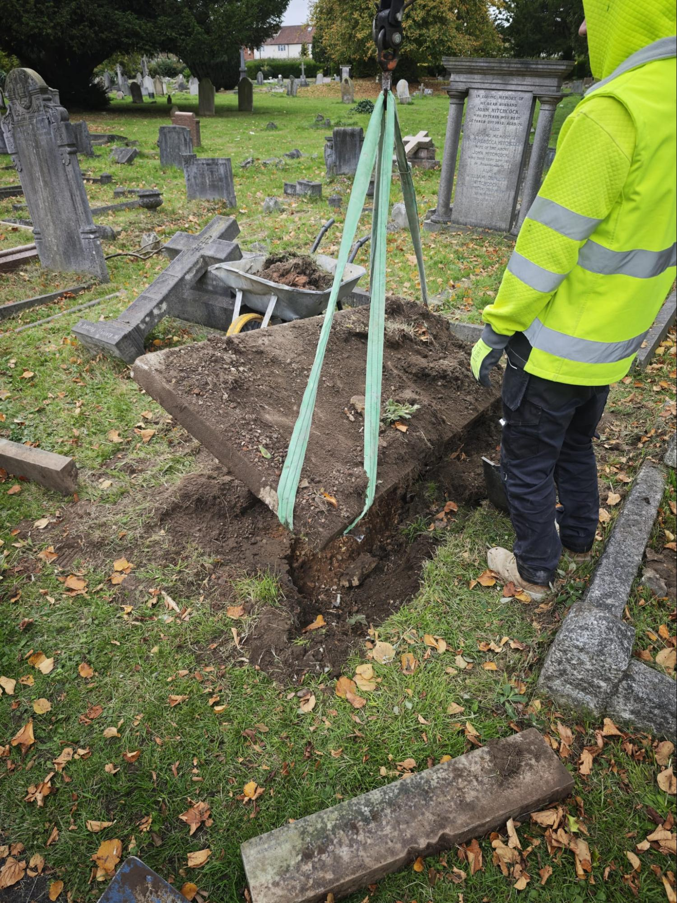
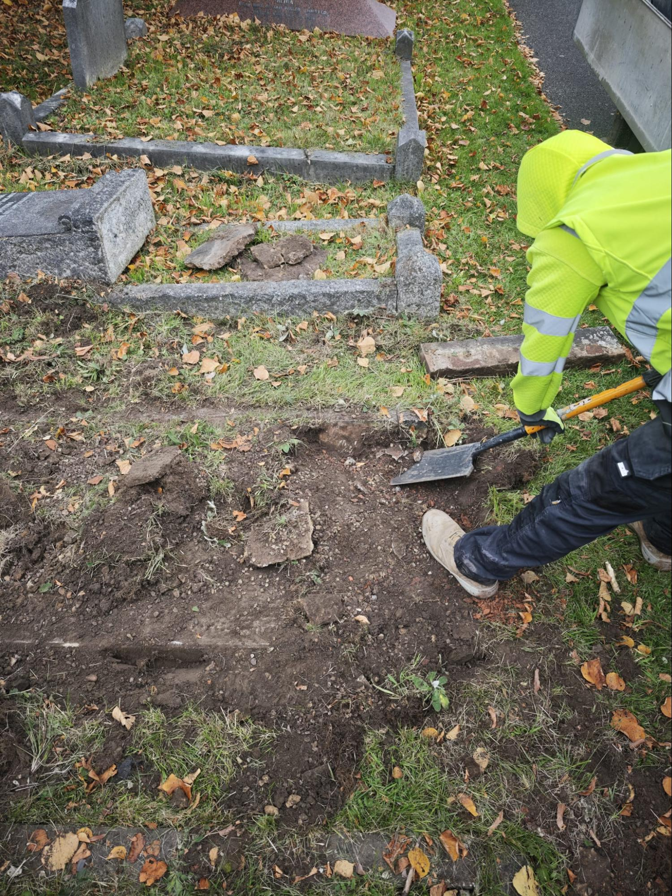
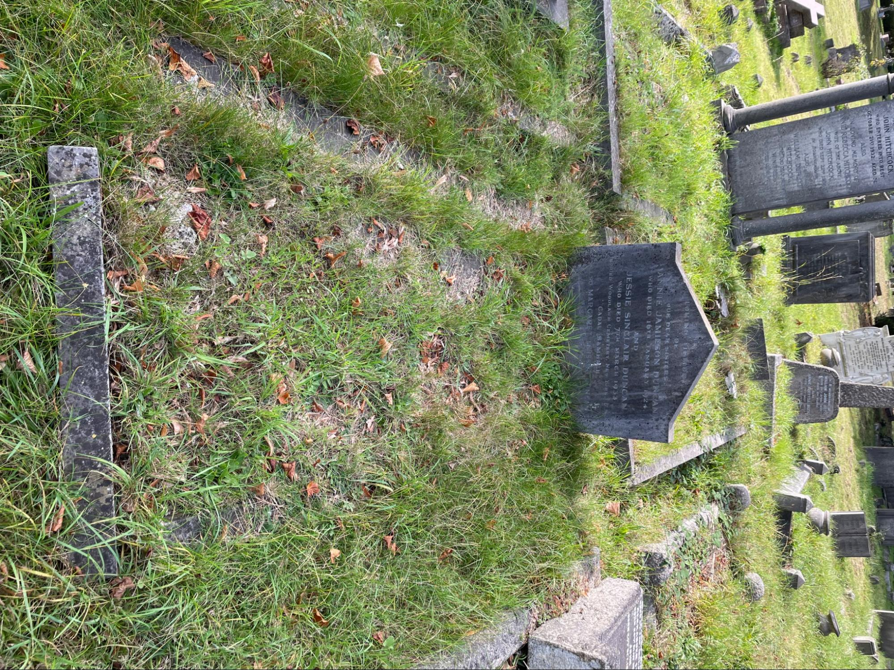

In 1925, the great Gaelic singer Margrat Duncan sang with Còisir Lunnainn at our first National Mòd, in Greenock. Margrat sang with our main choir and conducted our ladies’ choir. 

This year, to celebrate the 100th anniversary of our first Mòd, Còisir Lunnainn raised funds for the restoration of Margrat’s gravestone in Twickenham Cemetery. We are delighted that the work has been carried out and Margrat’s grave has been restored. 

We are grateful to all those who donated to this project — there is still some way to go to meet the funding, so all further donations are warmly welcomed. You can donate here: <https://www.crowdfunder.co.uk/p/margrat-duncan-grave-restoration>

When the stonemasons began their work, they discovered that the memorial was much larger than the portion visible above ground. Our thanks go to Kenward & Sons Monumental Masons for their work to restore the gravestone. 

Margaret Duncan, born in Islay in 1888, was one of the greatest Gaelic singers of her time. She won multiple competitions as a soloist and with her duet partner Archibald Ferguson. After the First World War, she moved from Glasgow to London to work as a nurse, and joined Còisir Lunnainn. Margrat passed away in London in 1948 and was buried in Twickenham Cemetery. After her death, the Glasgow Islay Association opened a memorial fund to commemorate her outstanding services to Gaelic music. This resulted in the Margrat Duncan Memorial Trophy, for which Còisir Lunnainn competes alongside other area choirs today. One of our conductors, Fergus, spoke to Cathy NicDhòmhnaill on Radio nan Gàidheal about Margrat Duncan, her connection with our choir and our project to restore her grave. 

<audio controls src="/251020_Fergus%20on%20Naoi%20gu%20Deich.mp3"></audio>

This year, to mark the anniversary and celebrate our connection to Margrat Duncan, we chose all of our own-choice pieces for the 2025 Lochaber Mòd from the 1925 set pieces. Like our choral forebears of a century ago, our lower voices came second in their competition and our other entries didn’t place — but we had a great time.

We look forward to holding a short commemoration at Margrat Duncan’s graveside in Twickenham Cemetery on Sunday 30 November at 3:30pm. If you are able to join us you would be most welcome.

## The restored grave

## Works in progress

## The grave before restoration

